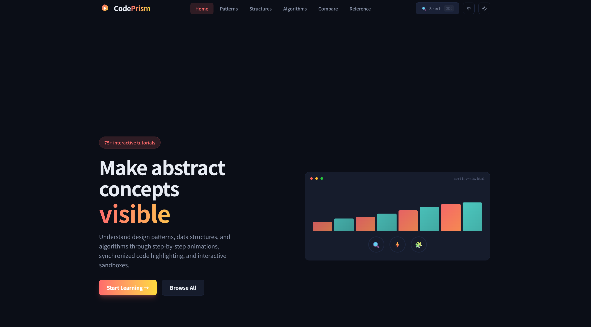
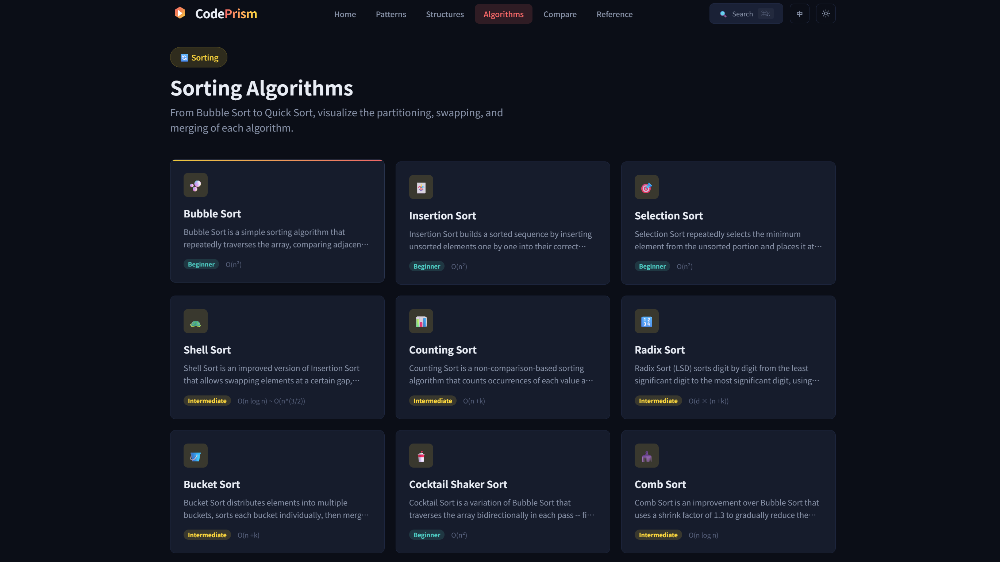
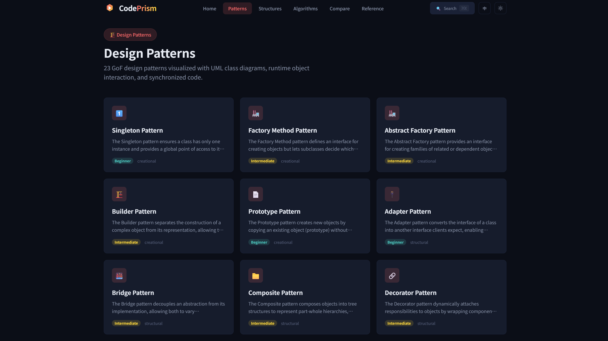
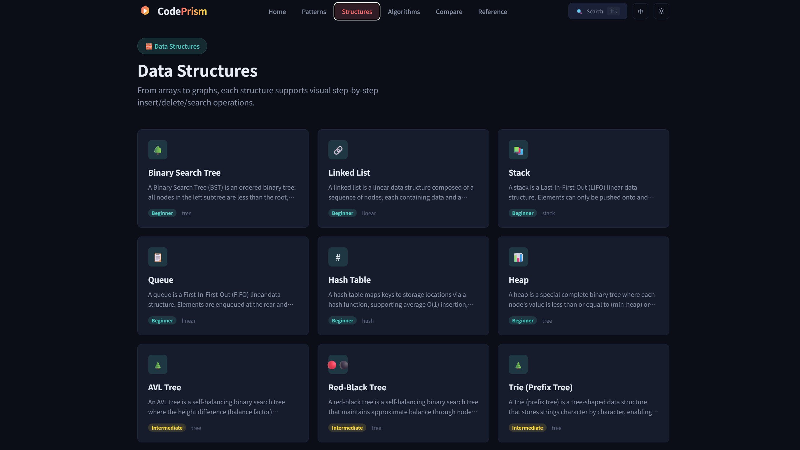

# CodePrism

<div align="center">

[](https://github.com/hupeng84/codeprism/actions/workflows/ci.yml)


**Interactive visual tutorials for Design Patterns, Data Structures & Algorithms**

[⭐ GitHub](https://github.com/hupeng84/codeprism) | [中文文档](README_ZH.md) | [Live Demo](https://codeprism.hujunxi.com) | [📖 Developer Guide](DEVELOPING.md) | [🐛 Issues](https://github.com/hupeng84/codeprism/issues)

</div>

---

## ✨ What is CodePrism?

CodePrism transforms abstract computing concepts into intuitive visual experiences. Watch algorithms execute step-by-step, see data structures evolve in real-time, and understand design patterns through interactive UML diagrams and object interactions.

## 🚀 Live Preview

<!-- Screenshots Section - Replace with your own screenshots -->
<div align="center">

| Homepage | Algorithm Visualizer |
|:---:|:---:|
|  |  |
| **Pattern Explorer** | **Data Structure View** |
|  |  |

*Click on images to enlarge*

</div>

## ✨ Features

### 🏗️ Design Patterns
23 GoF patterns with interactive features:
- **UML Class Diagrams** - Visual structure representation
- **Runtime Object Interaction** - Watch objects interact in real-time
- **Code Synchronization** - Highlighted code follows visualization

### 🧱 Data Structures
From basic to advanced, all visualized:
- **Array & Linked Lists** - Insert, delete, search operations
- **Trees** - BST, AVL, Red-Black, Trie, Segment Tree
- **Graphs** - Pathfinding, traversal, minimum spanning tree
- **Advanced** - Heap, Hash Table, Bloom Filter, LRU Cache

### ⚡ Algorithms
Step-by-step execution with deep insights:
- **Sorting** - 13 algorithms from bubble to merge sort
- **Searching** - Binary, linear, interpolation, and more
- **Graph** - BFS, DFS, Dijkstra, A*, Kruskal
- **Frame-by-frame Playback** - Full control over execution
- **Code Highlighting** - See which line is executing
- **Variable Tracking** - Watch state changes in real-time

### 🎨 Beautiful UI
- **Dark Theme** - Easy on the eyes during long study sessions
- **Smooth Animations** - 60fps transitions and interactions
- **Responsive Design** - Desktop, tablet, and mobile support
- **Monaco Editor** - Professional code viewing experience

## 🛠️ Tech Stack

| Category | Technology |
|----------|------------|
| **Framework** | Next.js 15 (App Router) |
| **Language** | TypeScript |
| **Styling** | Tailwind CSS v4 |
| **State Management** | Zustand |
| **Code Editor** | Monaco Editor |
| **Visualization** | Mermaid + React X Mermaid |
| **Graph Layout** | Dagre + XYFlow |
| **Package Manager** | pnpm + Turborepo |

## 📦 Project Structure

```
codeprism/
├── src/                      # Next.js App Router
│   └── app/                  # Route pages
├── packages/
│   ├── core/                 # Core visualization engine
│   │   ├── engine/           # Playback controller
│   │   └── renderers/        # Canvas renderers
│   ├── content/              # Tutorial content
│   │   ├── algorithms/       # Algorithm implementations
│   │   ├── structures/       # Data structure implementations
│   │   └── patterns/         # Design pattern implementations
│   └── ui/                   # Shared UI components
├── public/                   # Static assets
├── tests/                    # E2E tests (Playwright)
└── docs/                     # Documentation
```

## 🚀 Quick Start

### Prerequisites

- Node.js >= 22.0.0
- pnpm >= 10.33.0

### Installation

```bash
# Clone the repository
git clone https://github.com/hupeng84/codeprism.git
cd codeprism

# Install dependencies
pnpm install

# Start development server
pnpm dev
```

Open [http://localhost:3000](http://localhost:3000) in your browser.

### Build for Production

```bash
pnpm build
pnpm start
```

### Run Tests

```bash
# Unit tests
pnpm test

# E2E tests
pnpm test:e2e

# E2E with UI
pnpm test:e2e:ui
```

## 📋 Available Commands

| Command | Description |
|---------|-------------|
| `pnpm dev` | Start development server |
| `pnpm build` | Build all packages |
| `pnpm start` | Start production server |
| `pnpm test` | Run unit tests |
| `pnpm test:e2e` | Run E2E tests |
| `pnpm test:coverage` | Generate coverage report |
| `pnpm lint` | Lint code |
| `pnpm typecheck` | TypeScript type checking |
| `pnpm clean` | Clean build artifacts |

## 🐳 Docker Deployment

### Using Docker Compose (Recommended)

```bash
# Build and start
docker compose up -d

# View logs
docker compose logs -f

# Stop
docker compose down
```

### Direct Docker

```bash
# Build image
docker build -t codeprism .

# Run container
docker run -d -p 3000:3000 --name codeprism codeprism
```

### Production with SSL

```bash
# 1. Create nginx.conf
# 2. Place SSL certificates in ./certs/
# 3. Start with SSL profile
docker compose --profile ssl up -d
```

## 📚 Content Overview

### Sorting Algorithms (13)
| Algorithm | Time Complexity | Category |
|-----------|----------------|----------|
| Bubble Sort | O(n²) | Exchange |
| Quick Sort | O(n log n) | Divide & Conquer |
| Merge Sort | O(n log n) | Divide & Conquer |
| Heap Sort | O(n log n) | Selection |
| ... | ... | ... |

### Search Algorithms (7)
- Binary Search, Linear Search, Interpolation Search
- Jump Search, Exponential Search, Fibonacci Search, Ternary Search

### Data Structures (16)
- **Linear**: Array, Linked List, Stack, Queue
- **Tree**: BST, AVL, Red-Black, Trie, Segment Tree, Fenwick Tree
- **Graph**: Graph, Skip List
- **Advanced**: Hash Table, Heap, Union Find, LRU Cache, Bloom Filter

### Design Patterns (23)

| Category | Patterns |
|----------|----------|
| **Behavioral** | Observer, Command, Iterator, Mediator, Memento, State, Strategy, Template Method, Visitor |
| **Creational** | Abstract Factory, Builder, Prototype, Factory Method, Singleton |
| **Structural** | Adapter, Bridge, Composite, Decorator, Facade, Flyweight, Proxy |

## 🤝 Contributing

Contributions are welcome! Please feel free to submit a Pull Request.

1. Fork the repository
2. Create your feature branch (`git checkout -b feature/amazing-feature`)
3. Commit your changes (`git commit -m 'Add amazing feature'`)
4. Push to the branch (`git push origin feature/amazing-feature`)
5. Open a Pull Request

## 📄 License

This project is licensed under the **PolyForm Noncommercial License**.

> **Commercial Use Notice**: Commercial use of this project and derivative works is prohibited without explicit authorization.

See [LICENSE](LICENSE) file for details.

## ⭐ Star History

<div align="center">

<a href="https://star-history.com/#hupeng84/codeprism&Date">
  <picture>
    <source media="(prefers-color-scheme: dark)" srcset="https://api.star-history.com/svg?repos=hupeng84/codeprism&type=Date&theme=dark" />
    <source media="(prefers-color-scheme: light)" srcset="https://api.star-history.com/svg?repos=hupeng84/codeprism&type=Date" />
    
  </picture>
</a>

</div>

## ☕ Support

If CodePrism has helped you learn something new, you're welcome to buy me a coffee — it stays a coffee, not a contract. Donations don't influence feature priority or issue triage.

Scan one of the QR codes below to send a tip:

<div align="center">

| WeChat Pay · 微信支付 | Alipay · 支付宝 |
|:---:|:---:|
|  |  |

</div>

---

<div align="center">

**Made with ❤️ by [hupeng](https://github.com/hupeng84)**

**If you find CodePrism helpful, please give it a ⭐**

</div>